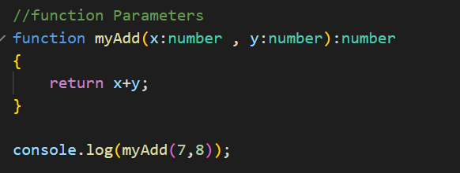

# Week 1

1. Typescript -&gt; naming variables along with datatype
2. A code editor req. --&gt; VS Code
3. npm should be installed
4. Install the typescript compiler using npm
5. Use of typescript compiler --&gt; Browser needs JS only, so we write code in typescript and with the help of typescript compiler, code will be converted to JS


[https://code.visualstudio.com/docs/typescript/typescript-compiling](https://code.visualstudio.com/docs/typescript/typescript-compiling)


### Concepts

#### 🐌 Implicit type

#### 🐌 Explicit type

#### 🐌 Custom type

#### ☝ Difference between variable declaration

#### ☝ Usage of interface in Typescript

#### ☝ Functions

#### 🐌 Named Functions

#### 🐌 Anonymous Function

#### ☝ Parameters

#### 🐌 Functional Parameters

#### 🐌 Default Parameters and Optional Parameter and rest parameter

\(or\)

#### ☝ Union

Declare more datatypes to a variable

#### ☝ Type Assertions

#### ☝ Duck Typing


[https://www.javatpoint.com/typescript-duck-typing](https://www.javatpoint.com/typescript-duck-typing)


Through the duck-typing rule TypeScript compiler checks that an object is same as other object or not.

According to the duck-typing method, both objects must have the same properties/variables types.

